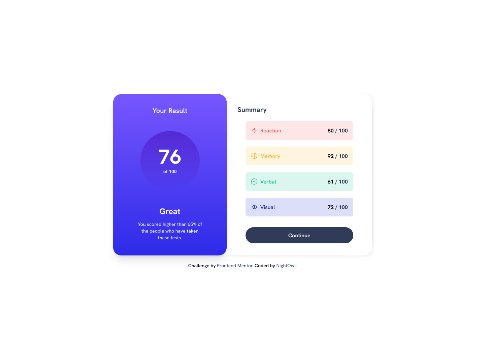

# Frontend Mentor - Results summary component solution

This is a solution to the [Results summary component challenge on Frontend Mentor](https://www.frontendmentor.io/challenges/results-summary-component-CE_K6s0maV). Frontend Mentor challenges help you improve your coding skills by building realistic projects.

## Table of contents

- [Overview](#overview)
  - [The challenge](#the-challenge)
  - [Screenshot](#screenshot)
  - [Links](#links)
- [My process](#my-process)
  - [Built with](#built-with)
  - [What I learned](#what-i-learned)
  - [Continued development](#continued-development)
  - [Useful resources](#useful-resources)
- [Author](#author)

## Overview

### The challenge

Users should be able to:

- View the optimal layout for the interface depending on their device's screen size
- See hover and focus states for all interactive elements on the page

### Screenshot



### Links

- Solution URL: [solution-url]()
- Live Site URL: [live-site-url]()

## My process

### Built with

- Semantic HTML5 markup
- CSS custom properties
- Flexbox
- Mobile-first workflow
- Vanilla Javascript
- [Tailwind](https://tailwindcss.com) - A utility-first CSS framework

### What I learned

I started this project with the idea of trying out [Tailwind Framework](https://tailwindcss.com) and I styled this project entirely with Tailwind CSS. Its easy to customize and it's very time saving than styling with traditional css.

**Some problems I have with using [Tailwind CDN](https://cdn.tailwindcss.com) so far**

- Adding Google font to a Tailwind Project
  First, copy the HTML links generated by Google Font website after choosing the font you are going to use and paste them inside the `<head>` tags in your `html` file.
  After that, add a new configuration for the font inside the config

```javascript
theme: {
  extend: {
    fontFamily: {
              sans: ["Hanken Grotesk", "sans-serif"],
    }
  }
}
```

- The default box-shadow is decent but it's not like the given design so I have to add new custom rule inside the config

```javascript
theme: {
  extend: {
    boxShadow: {
      custom: "-50px 10px 13px -18px rgba(0,0,0,0.15), 15px 15px 13px -18px rgba(0,0,0,0.15), 15px -8px 15px -18px rgba(0,0,0,0.15);",
    }
  }
}
```

- The default biggest max-height from Tailwind is `max-h-96(24rem)` , so I have to add another new custom rules for the max-height. The difference between `max-h-96(24rem)` and `max-h-80(20rem)` is `16(4rem)` that's why I give these two their respective name.

```javascript
theme: {
  extend: {
    maxHeight: {
              112: "28rem",
              120: "30rem",
    }
  }
}
```

### Continued development

I'm still not satisfy with those redundant classnames inside the HTML file. I'll try to improve myself in naming custom rules and writing clean code.

### Useful resources

- [how-to-add-google-fonts-tailwind](https://www.elvisduru.com/blog/how-to-add-google-fonts-tailwind) - This article helped me how to add Google fonts to a Tailwind Project
- [box-shadow.dev](https://box-shadow.dev/) - This helped me in generating similar box-shadow style like the given design
- [tailwind-cheat-sheet](https://nerdcave.com/tailwind-cheat-sheet) - This Tailwind cheat sheet helped me a lot while building this project due to its short but gets the point approach.
- [tailwind-documentation](https://tailwindcss.com/docs/) - The official documentation page of Tailwind CSS

## Author

- Github / [night_owl](https://github.com/AMyintMyatAung)
- Frontend Mentor / [@AMyintMyatAung](https://www.frontendmentor.io/profile/AMyintMyatAung)
